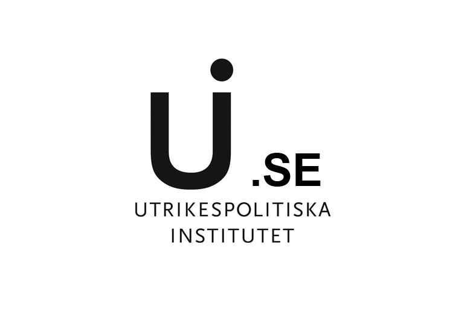

# Outreach

    

        
    

    

        <h3 class="publication-title">
                Theoretical approaches to corruption and anti-corruption: The Varieties of Corruption approach
            </a>
        </h3>
        
Lecture

        
University of Gothenburg

        
Buker, H. Nistotskaya, M.

        
Forthcoming, 26 Feb 2026

        

            Corruption
            Quality of Government
            Varieties of Corruption
        

    

    

        
    

    

        <h3 class="publication-title">
                Balancing Knowledge? Accumulated expertise vs local knowledge in donor anti-corruption efforts
            </a>
        </h3>
        
The Public Administration and Public Policy Seminar (PAPP)

        
University of Gothenburg

        
Buker, H. Nistotskaya, M.

        
20 Oct 2025

        

            Knowledge
            Development Cooperation
            Anti-Corruption
        

    

    

        
    

    

        <h3 class="publication-title">
                Evidence-Based Anti-Corruption? Evaluation of Sida's Efforts to Reduce Corruption in Partner Countries
            </a>
        </h3>
        
Swedish Institute of International Affairs (UI)

        
Buker, H. Persson, A. Gafuri, A.

        
15 May 2025

        

            Anti-Corruption
            Development Cooperation
            Theories of Change
        

    

    

        
    

    

        <h3 class="publication-title">
            <a href="https://gupea.ub.gu.se/items/dab325d7-cc10-4700-924e-1a269d82ed4a" class="publication-link">
                Policy Pathways to Sustainable Well-Being and Peace through Investments in Institutional Quality, Health Equity and Gender Equality under Crisis and Conflict
            </a>
        </h3>
        
QoG/LANCET Policy Day

        
Panel 4: Humanitarian assistance and development cooperation in fragile states

        
Buker, H. Persson, A.

        
26 Nov 2024

        

            Anti-Corruption
            Corruption as an obstacle to development
            Rights-Based Approaches
            Poor Peoples' Perspective
        

    

